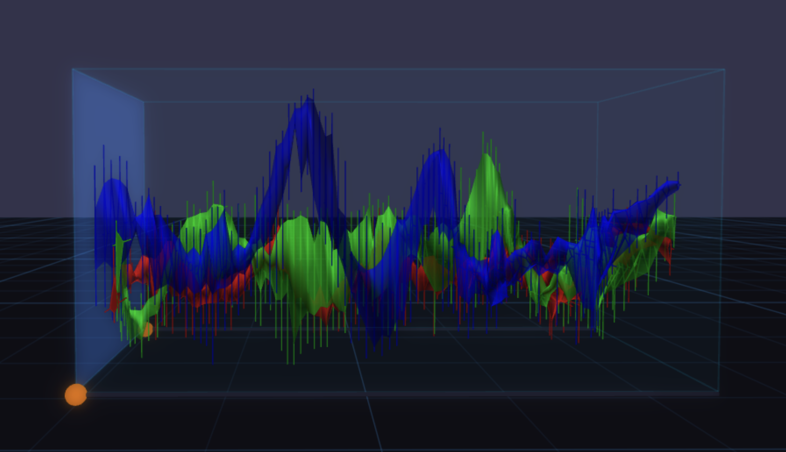
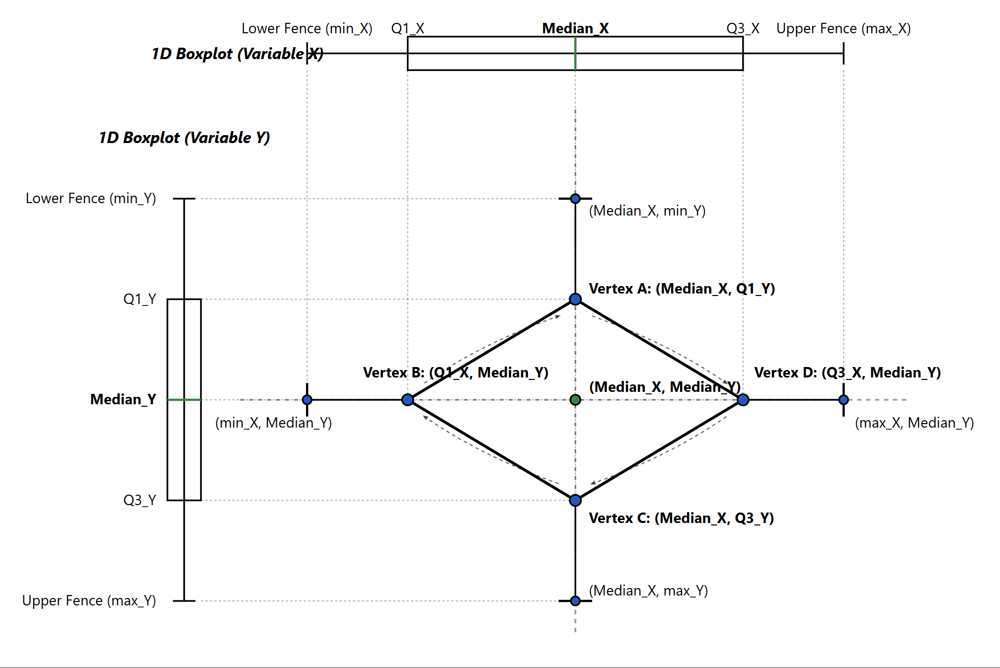
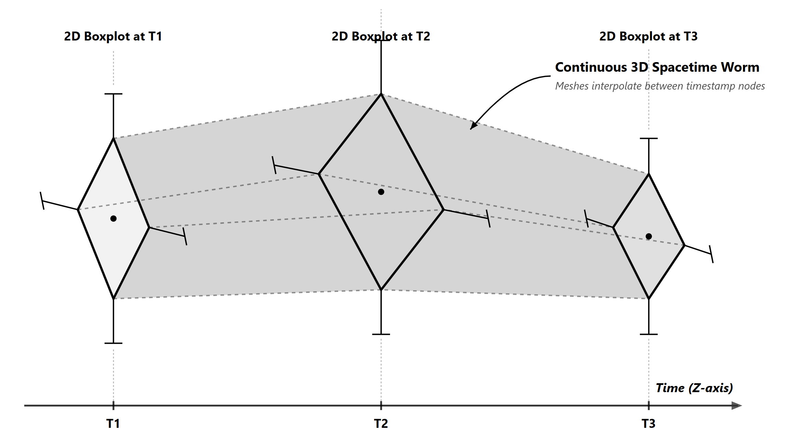
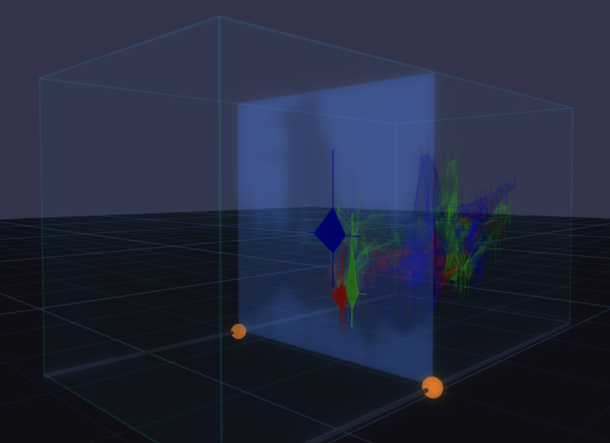
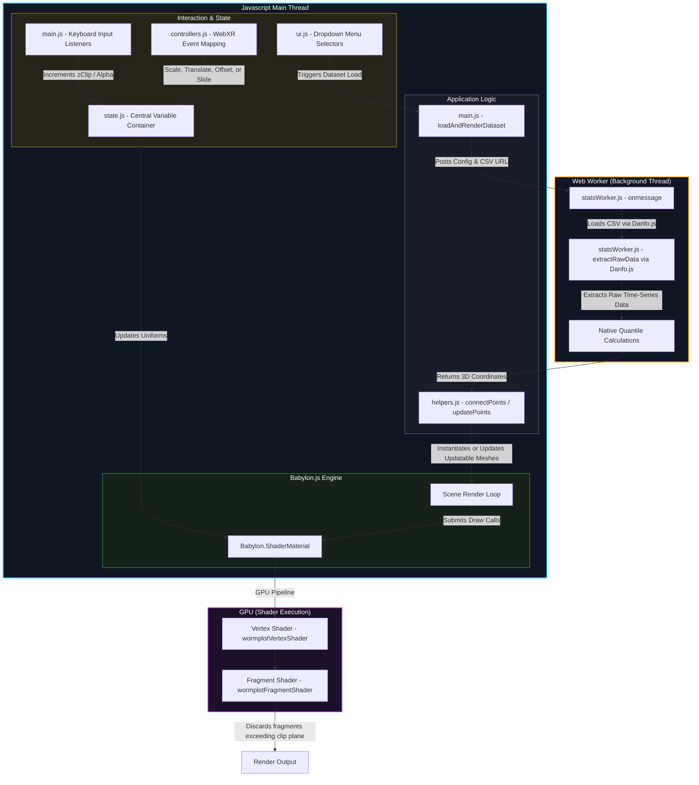

# Immersive Wormplots in VR

  

An immersive analytics tool built to explore multivariate time-series data using **3D Spacetime Wormplots** in virtual reality. Wormplots combine the statistical power of boxplots with the spatial analysis and interaction capabilites in VR. This application lets you walk through, slice, scale, and manipulate complex grouped time-series data in a way that flat screens simply cannot support.

> **Note on VR hardware**: This project is built using BabylonJS 3D Web Engine. It runs directly in any WebXR-compliant browser (such as Oculus Browser on Meta Quest 2/3/Pro, or any WebXR supported browser) on localhost or an HTTPS connection.

---

###  Live Deployment
Explore the live deployment of this project directly in your WebXR-compatible browser or headset:
 **[https://vga-t.github.io/Immersive-Wormplots-in-VR/](https://vga-t.github.io/Immersive-Wormplots-in-VR/)**

---

### Why VR? The Case for Immersive Analytics
Traditional 2D line charts and scatter plots quickly devolve into a "spaghetti mess" when you attempt to plot multiple variables for several groups over long timelines. 

If you try to solve this by rendering 3D plots on a flat 2D monitor, you run into serious cognitive hurdles:
* Distances along the depth axis are hard to judge.
* Foreground data blocks background data, requiring constant manual rotation with a mouse.
* It is difficult to appreciate the rate of change or the spread of variance.

**Virtual Reality solves this.** In a stereoscopic environment, your brain processes depth cues naturally. By walking around the data, you leverage head-coupled parallax to instantly resolve occlusion. By using physical hand gestures (like grabbing and pinching), exploring high-dimensional datasets becomes a kinetic, tactile experience.

---

## Conceptual Foundation: What is a Wormplot?

The wormplot technique was originally introduced by Geoffrey Matthews and Mike Roze in 1997 (*IEEE Computer Graphics and Applications*) as a way to visualize how groups of data points change over time.

Instead of plotting every individual data point, which causes extreme visual clutter, the authors summarize the data points at each time slice using 2D geometric shapes:

They proposed two summarization techniques.
1. **Circular Cross-Sections**: Summarizes the data with a circle where the center is the group's centroid (mean), and the radius is the average distance of the points from the center.
2. **2D Diamond-Whisker Boxplots (Implemented in this project)**: Tukey's 1D box-and-whisker plot can be extended to two dimensions:

  

   * Two orthogonal 1D boxplots intersect at their median point.
   * The Q1, median and Q3 of the two box plots can be sequentially connected in 3D space to form the summarizing structure. 
     $$\text{Vertex}_0 = (\text{median}_X, Q1_Y)$$
     $$\text{Vertex}_1 = (Q1_X, \text{median}_Y)$$
     $$\text{Vertex}_2 = (\text{median}_X, Q3_Y)$$
     $$\text{Vertex}_3 = (Q3_X, \text{median}_Y)$$
   * **Whiskers** extend outwards along both axes to represent the minimum and maximum values within $1.5 \times \text{IQR}$ (excluding outliers). These whiskers project directly from the diamond corners along the lines of central tendency to the **Tukey adjacent values** (the most extreme observations remaining within the lower fence $Q1 - 1.5 \times \text{IQR}$ and upper fence $Q3 + 1.5 \times \text{IQR}$).
   
By ordering these 2D shapes chronologically along the Z-axis (time) and connecting them, a continuous **3D spacetime worm** can be generalized. The thickness of the worm represents variance, its position in the X-Y plane represents the median values of the two attributes, and its progression along the Z-axis tracks time.



---

## Interaction Design & VR Features

Exploring data in VR requires a different interaction paradigm than desktop interfaces. We designed several physical interaction patterns to make data manipulation fluid:

### 1. Multi-threaded Calculations (Web Workers)
CSV parsing and the heavy statistical calculations (sorting, quantile interpolations, and fence boundaries) are offloaded to a background thread inside `statsWorker.js`. This keeps the browser's main thread free to focus entirely on rendering and input tracking.


### 2. GPU-Slicing & Dynamic Capping (Z-Clipping)

 
  
To examine the exact data distribution at a specific moment in time, users can slice the worms along the time axis (Z-axis). 
* **GPU-Based Slicing**: Instead of regenerating the mesh on the CPU (which would destroy frame rate), a custom GLSL vertex and fragment shaders. The shader checks the local vertex position against a clipping uniform (`uClipZ`) and discards fragments on the GPU:
  ```glsl
  if (vLocalPos.z > uClipZ) {
      discard;
  }
  ```
* **Dynamic 2D Cross-Sections (Capping)**: As you slide the clipping plane, the application interpolates the 8 control points of the diamond-whisker structure between the surrounding timestamps. It then draws a solid capping polygon and detailed whiskers at the cut line, giving you an instantaneous 2D boxplot view of all groups at that exact moment.
* **Slider Tracking**: The clipping plane is controlled by grabbing and sliding two orange spheres on tracks on either side of the visualization container.
* **Snapping**: When you release the slider handle, it automatically snaps to the closest actual timestamp in the dataset to prevent floating between data points.


---


## Interaction Design & Controller Bindings

The application supports both VR controller inputs (when in a headset) and keyboard/mouse fallbacks (for desktop testing).

### WebXR Controller Bindings
When inside a VR session, hold your controllers and use these mappings:

* **Pinch-to-Scale & Translate (Grab & Move)**: 
  * **How to use**: Hold the **Squeeze (Grip) buttons** on both controllers simultaneously.
  * **Result**: Moving the controllers closer together or further apart scales the visualization container uniformly. Translating your hands moves the entire visualization container with them.
* **Adjust Transparency (Opacity)**:
  * **How to use**: Press the buttons on the **Left Controller**.
  * **Result**: Hold `X-Button` to decrease the visibility of the worms (make them more transparent); hold `Y-Button` to make them more opaque.
* **Scrub Time Axis (Clipping Plane)**:
  * **How to use**: Press the buttons on the **Right Controller**.
  * **Result**: Hold `A-Button` to pull the clipping plane backwards (earlier in time); hold `B-Button` to push it forwards.

### Desktop Keyboard Fallbacks
If you are testing on a flat screen without a headset, use the following key bindings:

* **W / Q Keys**: Increase / Decrease worm transparency (opacity).
* **R / E Keys**: Scrub the clipping plane forwards / backwards along the time axis.
* **Mouse Dragging**: Drag the orange spheres on the side tracks to slice the data. When released, the plane automatically snaps to the closest discrete dataset timestamp.
* **Web UI Panels**: Use the HTML dropdown menus at the top right of the screen to change datasets (Weather, Toxicology) and rebind variables to the X and Y axes.

### Floor Collision System
To prevent the data from disappearing into the physical ground when scaled up or translated, `controllers.js` tracks the bottom four corners of the boundary volume box. If any corner dips below the floor grid ($Y = 0$), the container is automatically pushed back up to an ergonomic height.

---

## Technical Architecture & Performance Optimization

Maintaining a steady 90+ FPS in a VR headset is critical to avoid motion sickness. I structured the codebase to keep the rendering loop light:




### Key Modules:
* [main.js](./main.js): Handles Babylon.js scene initialization, lighting, cameras, WebXR session creation, GLSL shader compilation, and the render loop.
* [controllers.js](/controllers.js): Binds WebXR motion controller inputs, handles pinch-to-scale calculations, floor collision prevention, and button state machine.
* [helpers.js](./helpers.js): Generates the dynamic ribbon meshes and line systems, sets shader uniforms, and computes the interpolated capping geometry.
* [statsWorker.js](./statsWorker.js): Runs on a background thread to calculate quantiles, IQRs, and fences for every time slice. This ensures the main thread stays locked at a smooth rendering rate.
* [state.js](./state.js): Acts as a centralized, mutable state container, breaking circular dependencies between modules.
* [config.js](./config.js): Manages configuration profiles for different datasets, color schemes, and axes mapping.

---

## Case Study: Meteorological Trends in German Cities (2009–2024)

To validate the tool, I analyzed a dataset from `meteostat` tracking daily weather attributes for 10 German cities (Berlin, Hamburg, Munich, Frankfurt, Cologne, Stuttgart, Dresden, Leipzig, Rostock, and Freiburg) over 15 years.

#### 1. Warming Winters (Min Temp vs. Max Temp)
Plotting minimum vs. maximum temperature over the 15-year span shows a clear expansion of the worms towards higher values during non-summer months. The winter shapes become noticeably "fatter," indicating that while winter temperatures are rising, their variance has also increased—leading to unstable, milder winters punctuated by volatile cold snaps.

#### 2. Snowfall & Pressure Dynamics
Comparing snowfall and atmospheric pressure revealed a strong negative correlation. The winter of 2009/2010 appears as a huge horizontal spike with wide diamonds, representing the historic snowfall across Hamburg, Rostock, and Dresden. As you scrub forward in time, these spikes steadily shrink, showing a clear, visual decline in winter snowfall across Germany.

#### 3. Shared Coastal Climates
By isolating the worms for Hamburg and Rostock, their spatial trajectories map closely to one another. The shapes match in both volume (variance) and coordinates, visually separating the shared coastal climate dynamics of northern Germany from southern cities like Munich or Freiburg.

---

## Live Demo & Deployment

The latest version of the project is compiled and deployed live:
🔗 **[Live WebXR Wormplots Demo](https://vga-t.github.io/Immersive-Wormplots-in-VR/)**

---

## Prerequisites & System Requirements

Before running the application locally or setting up your development environment, ensure you meet the following requirements:
* **WebXR Hardware / Emulator**: An OpenXR-compliant VR headset (such as Meta Quest 2/3/Pro, Pico 4, or Apple Vision Pro) with a supporting browser (e.g., Oculus Browser). Alternatively, for desktop development, you can use the **WebXR API Emulator** extension for Chrome or Firefox.
* **Modern Web Browser**: A browser with WebXR Device API support enabled.
* **Local HTTP Server**: A static server utility (such as Node.js with `http-server` installed or VS Code's Live Server extension).
* **Secure Context**: WebXR features are only enabled on secure origins (`https://`) or local loopback origins (`localhost` or `127.0.0.1`).

---

## How to Run & Debug Locally

### 1. Serve the Files
Clone the repository and run a local static file server:
```bash
git clone https://github.com/vga-t/Immersive-Wormplots-in-VR.git
cd Immersive-Wormplots-in-VR

# Start a server
npx http-server -p 8080 .
```
Or you could use the Live Server extension in your IDE (like VS Code) to serve it on localhost.

---

## Forking & Extensibility

If you are a developer looking to build upon this project or experiment, the codebase is modularized to support custom visualizations and extension:

### Key Extension Points:
* **Adding New Visual Cross-Sections**: To support circular shapes or custom contours instead of Tukey 2D boxplots, modify the data aggregation logic in [statsWorker.js](./statsWorker.js). The main thread will automatically read the updated points and re-render the ribbon.
* **Extending to More Attributes**: Currently, the system maps two user-selected attributes to the X and Y axes, while Z maps to time. You can extend this to represent a third variable by shifting the boxplot calculations to a 3D coordinate system.
* **Shader Customization**: The custom fragment shader in [main.js](./main.js#L28-L52) manages real-time Z-axis clipping. You can add new visual effects, or other interaction mechanics.

Feel free to fork the repository, experiment with new interaction mechanics, and submit pull requests!

---

## License

This project is licensed under the MIT License - see the [LICENSE](LICENSE) file for details.
